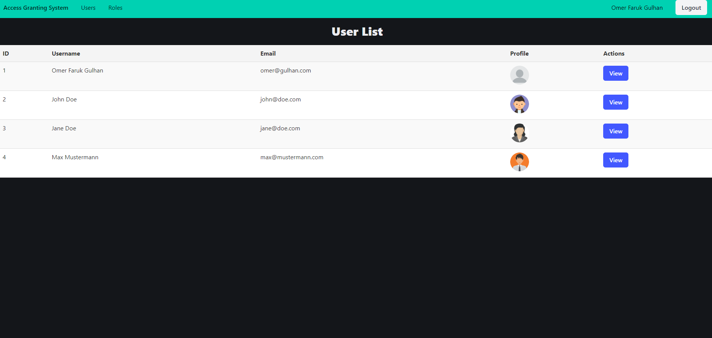
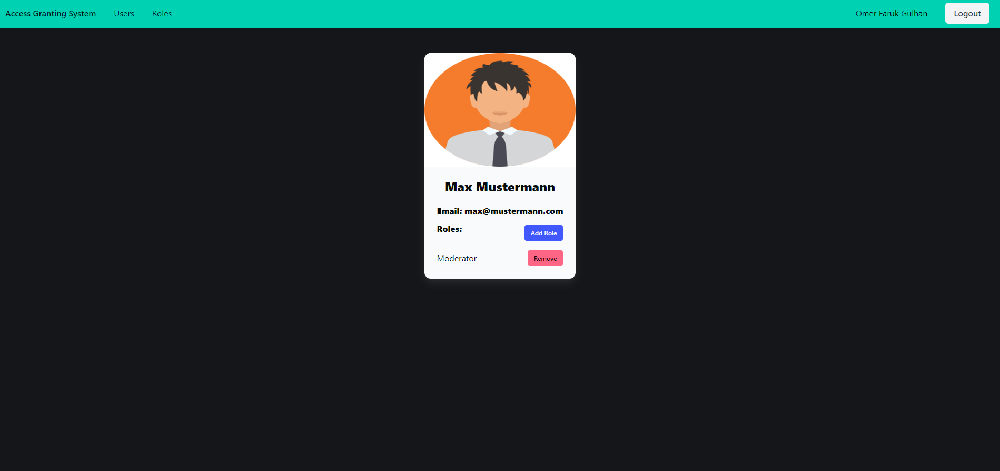
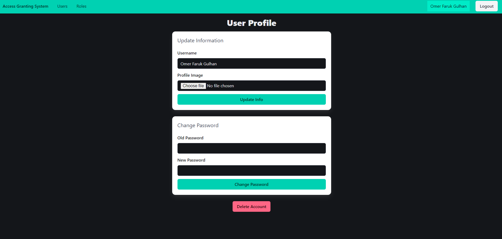
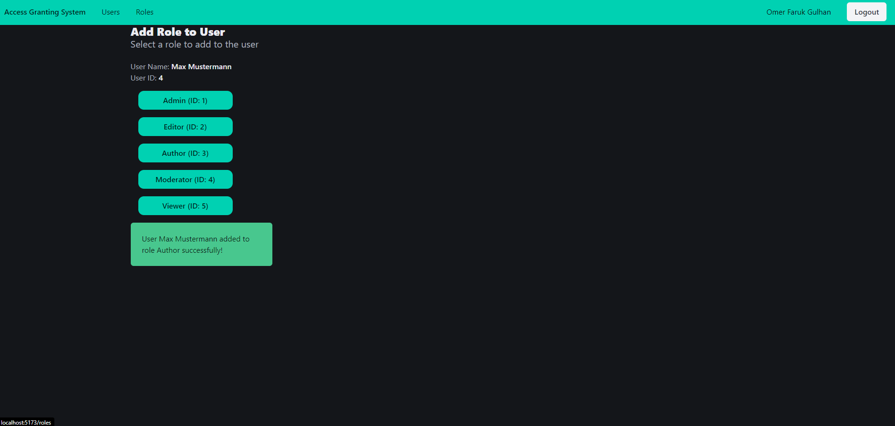
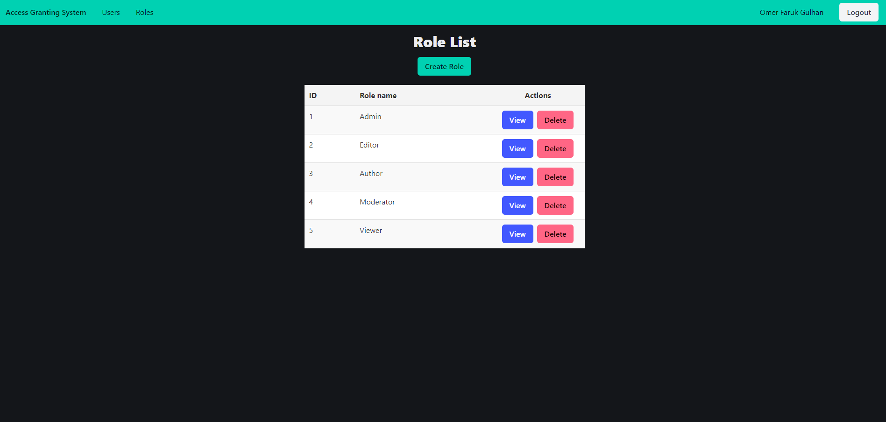
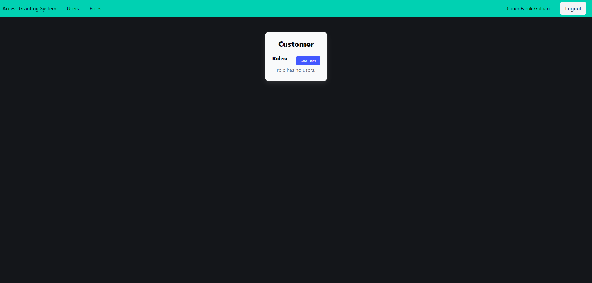
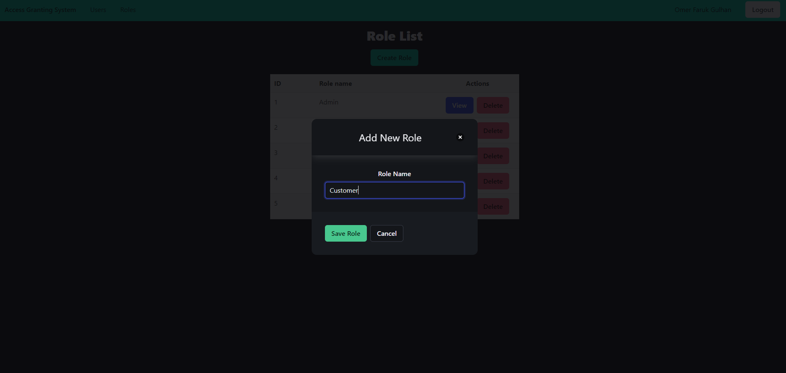
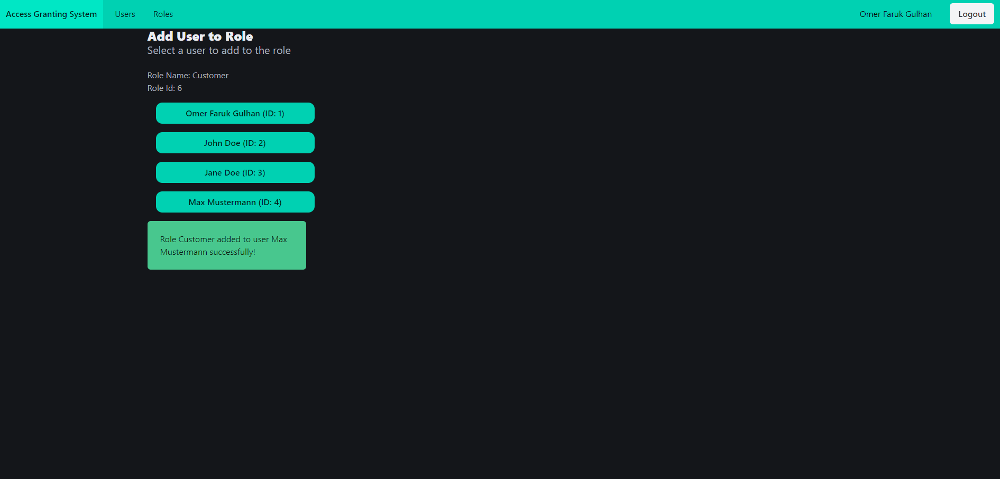

# access-granting-system--go-vue

## Table of Contents

1. [Introduction](#introduction)
2. [Features](#features)
3. [Tech Stack](#tech-stack)
4. [Installation and Usage](#installation-and-usage)
5. [API Endpoints](#api-endpoints)
6. [Images](#images)

## Introduction

The Access Granting System is a full-stack application that allows users to manage authentication and authorization. Users can grant or revoke roles, manage user access levels, and perform various administrative tasks within the app. This system is designed to provide a robust solution for managing user permissions in a multi-user environment.

## Features

- User authentication and authorization.
- Role management: authorized users can create or delete roles, assign or revoke roles from other users.
- User profile management.

## Tech Stack

### Frontend

- **Vue.js**: JavaScript framework for building user interfaces.
- **Vuex**: State management pattern + library for Vue.js applications.
- **Vue Router**: For managing navigation and routes in a multi-page application.
- **Axios**: Promise-based HTTP client for making requests to the backend.
- **Bulma**: CSS framework for styling the application.

### Backend

- **PostgreSQL**: Relational database management system for storing user data and roles.
- **Gin**: Web framework for building RESTful APIs in Go.
- **JWT (JSON Web Tokens)**: For handling authentication securely.
- **GORM**: ORM (Object Relational Mapping) library for Go, facilitating database operations.

## Installation and Usage

To set up the Access Granting System on your local machine, follow these steps:

### Prerequisites

Before you begin, ensure you have the following software installed:

- **Go** (version 1.16 or higher): [Download Go](https://golang.org/dl/)
- **Node.js** (version 14 or higher): [Download Node.js](https://nodejs.org/en/download/)
- **PostgreSQL**: [Download PostgreSQL](https://www.postgresql.org/download/)

### Steps to Install

- Open your terminal and run the following commands

```bash
git clone https://github.com/yourusername/access-granting-system-go-vue.git
```

```
cd access-granting-system-go-vue
```

```
cd server
go mod tidy
```

- Create a .env file in the backend directory with the following content, adjusting the values as needed:

```
EMAIL_HOST=
EMAIL_PORT=
EMAIL_USERNAME=
EMAIL_PASSWORD=
EMAIL_FROM=
BASE_URL=
SERVER_URL=
CLIENT_URL=
JWT_SECRET_KEY=
DB_HOST=
DB_PORT=
DB_USER=
DB_PASSWORD=
DB_NAME=
DB_MAX_CONNECTIONS=
DB_MAX_IDLE_TIME=
```

```
go run main.go
```

- Set Up the Frontend

```
cd client
npm i
npm run dev
```

## API Endpoints

### Authentication

- `POST /auth/register`: Register a new user.
- `POST /auth/login`: Authenticate users and retrieve a JWT token.

### Users

- `GET /users`: Retrieve all users.
- `GET /users/:id`: Retrieve a specific user by ID.
- `POST /users`: Add a new user.
- `PUT /users/activate/:token`: Activate a user account using a token.
- `PUT /users/:id`: Update user details.
- `PUT /users/update-password`: Update the user's password.
- `PUT /users/reset-password`: Reset the user's password.
- `PUT /users/reset-password/verify/:token`: Set a new password using a verification token.
- `DELETE /users/:id`: Delete a user.

### Roles

- `GET /roles`: Retrieve all roles.
- `GET /roles/:id`: Retrieve a specific role by ID.
- `POST /roles`: Add a new role.
- `PUT /roles/:id`: Update a role.
- `DELETE /roles/:id`: Delete a role.

### User Roles

- `POST /user-roles`: Assign a role to a user.
- `DELETE /user-roles/:userId/:roleId`: Remove a role from a user.

### Profile Images

- `GET /profile-images/*filepath`: Serve profile images.
- `HEAD /profile-images/*filepath`: Serve profile images (HEAD request).

## Images

### Users Page



### User Info



### User Profile



### Add Role to User



### Roles Page



### Role Info



### Add Role



### Add User to Role


